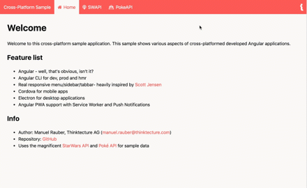
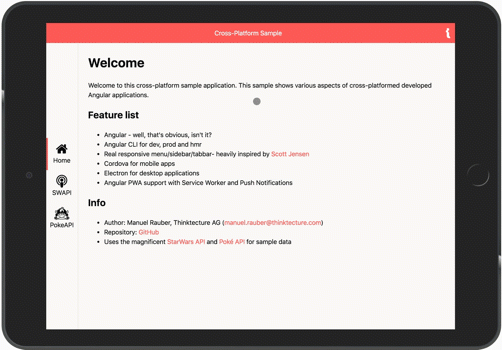
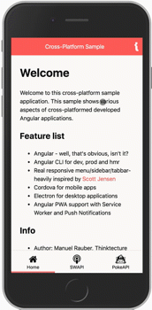

# Cross-Platform Sample Application

This part contains a cross platform sample application using Angular 5, Angular CLI 1.6-RC.1 and Angular Service Worker.
Although in this part (due to the parts before) Cordova and Electron are also included - but they will not work with `--prod` flag.
They only work for dev. 
The `--prod` works in the other parts (which are currently Angular 4, but the only change will be the switch from `Http` to `HttpClient`).
This repo is more for showcasing the Angular Service Worker stuff. :-)

Please take a look at the blog posts from Maxim Salnikov for more in-depth information about the new Angular Service Worker:

* [A new Angular Service Worker — creating automatic progressive web apps. Part 1: theory](https://medium.com/@webmaxru/a-new-angular-service-worker-creating-automatic-progressive-web-apps-part-1-theory-37d7d7647cc7)
* [A new Angular Service Worker — creating automatic progressive web apps. Part 2: practice](https://medium.com/google-developer-experts/a-new-angular-service-worker-creating-automatic-progressive-web-apps-part-2-practice-3221471269a1)

But have in mind, that his blog posts are made for Angular 5 and Angular CLI 1.5, which does not support building the service worker part directly.
This has been fixed in the Angular CLI 1.6-RC.1, which is used in this repo. 
But the config of the service worker is still valid.

## Setup

* `npm i`
* Generate new keys for VAPID using [https://web-push-codelab.glitch.me/](https://web-push-codelab.glitch.me/), or use the ones within the repo (since they are demo keys, I pushed them to the repo)
  * Change within the web-push server: [`srcApi/controllers/push.js`](srcApi/controllers/push.js)
  * Change within the app: [`src/app/services/notification.ts`](src/app/services/notification.ts)

## Start

* Push Server: `npm run push-server`
* Prod App: `npm run start-prod`

Unfortunately there is currently no support for using `ng serve --prod` with the service worker using Angular CLI 1.6-RC.1. 
So you have to run the command again, after you've changed something (or add `nodemon` to the npm scripts for restarting the static http server).

## This is how it looks like

### Web

### Tablet

### Phone

## Note

The code shows different concepts of doing things, this is why some problems are solved in a different way. :-)
